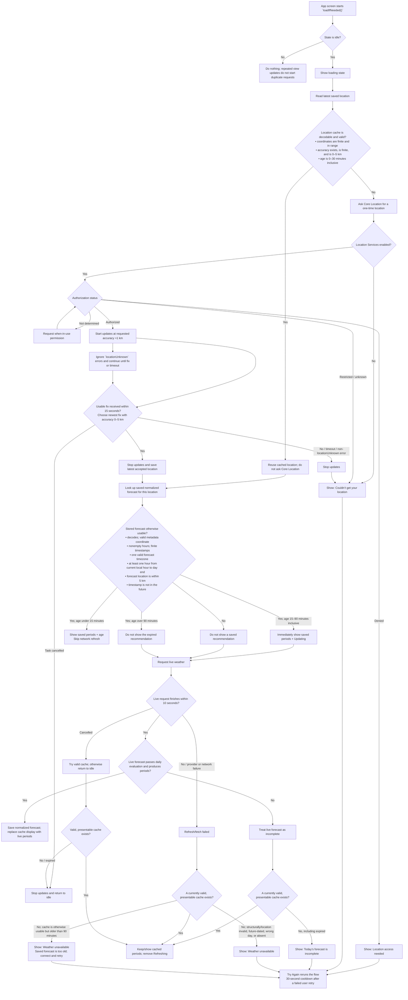
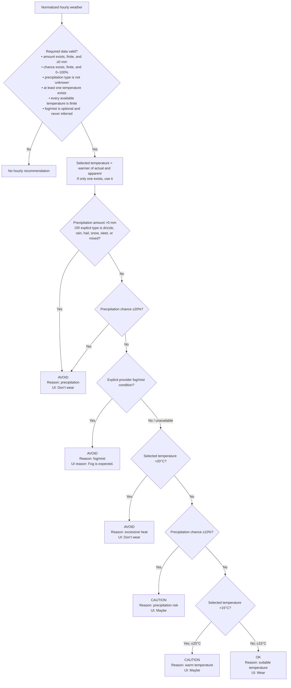
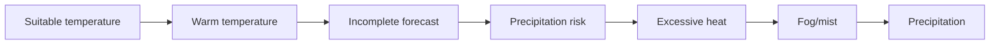
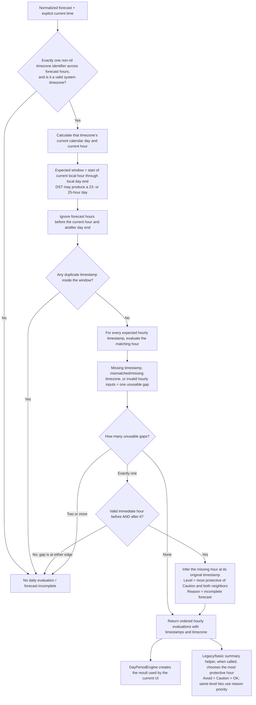
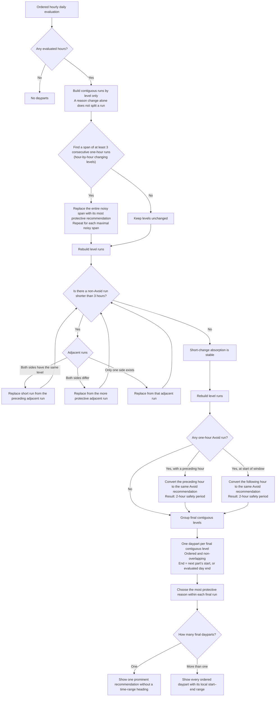
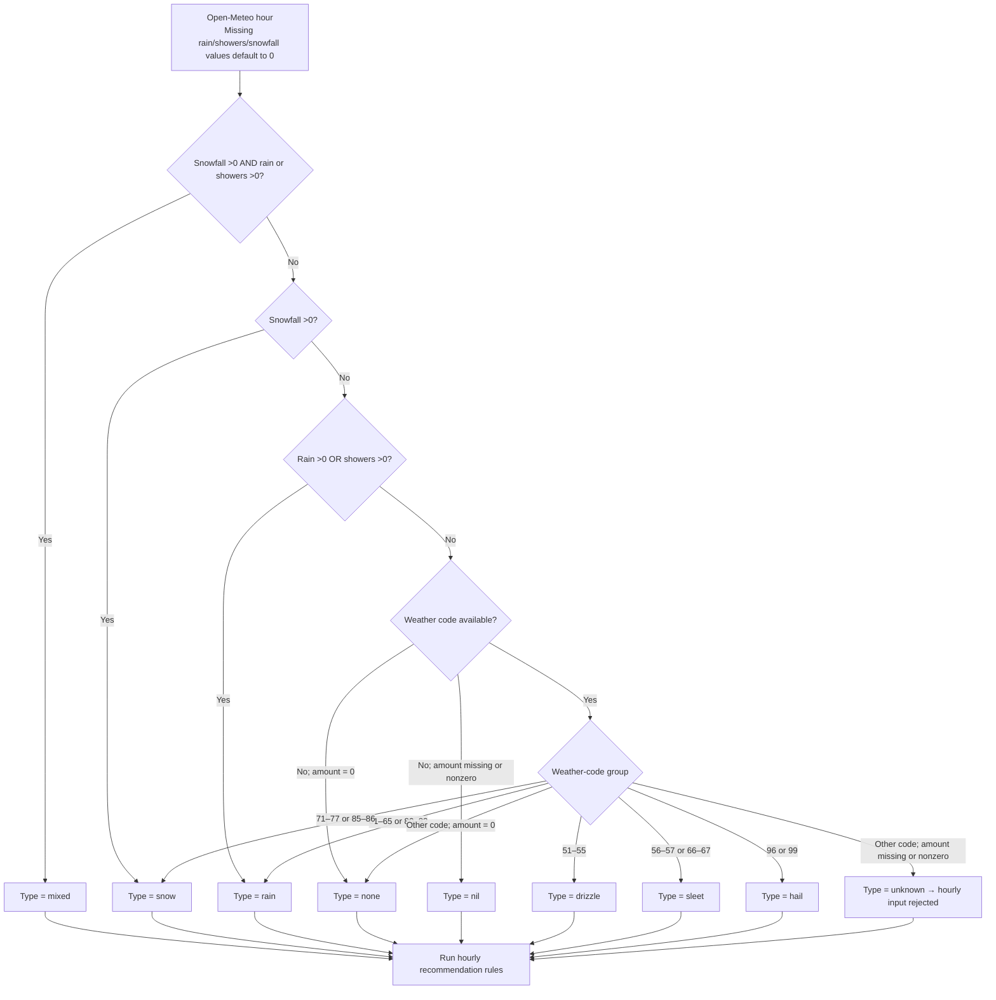
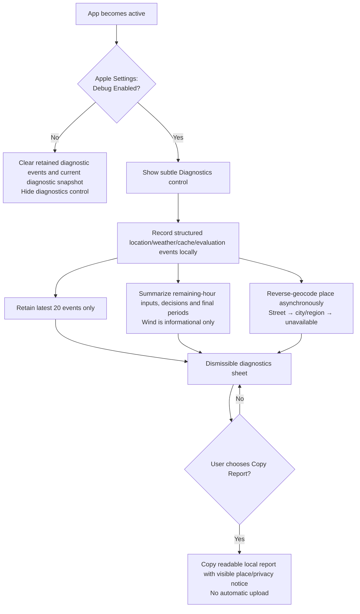

# Can I Wear — Implemented Rules Flowcharts

> Status: DESCRIPTIVE IMPLEMENTATION REFERENCE
> Source of truth: NO — approved behavior remains in `DECISIONS.md` and the other truth files
> Generated from the implementation on 2026-10-09

These charts describe the rules currently implemented in the app. They do not approve any remaining TBD product or UX decisions. Values shown below come from `AppConfiguration.swift`.

## 1. Location, weather, and cache flow

The app applies the same weather-age policy on launch, foreground activation and active-screen boundaries. Exactly 15 minutes starts refresh; exactly 90 minutes remains visible while refresh runs; any amount over 90 minutes is stale. A stale forecast is classified as “expired” only after storage, structure, current-day coverage, location match and non-future timestamp checks pass. Other rejected cache entries are unavailable.

Pull-to-refresh uses the same flow but never starts a provider request before 15 minutes, while another request runs, or during the 30-second post-failure cooldown. A blocked pull retains the current recommendation and the home-screen status explains when refresh is available. No two weather requests run concurrently.

## 2. Hourly OK, Caution, and Avoid rules

The ordering implements protective precedence:

1. Invalid data produces no answer.
2. Actual precipitation or an explicit precipitation type overrides everything.
3. A precipitation chance of at least 20% produces Avoid.
4. An explicit fog/mist condition produces Avoid and outranks heat/caution/okay results.
5. Excessive heat outranks a precipitation-only Caution.
6. A 10%–less-than-20% precipitation chance outranks an otherwise OK temperature.

`nil` precipitation type does not by itself invalidate an hour; `unknown` does. Amount and probability are still required.

When multiple recommendations of the same level must be reduced to one reason, the implemented least-to-most-protective reason priority is:

## 3. Daily forecast window and completeness

This separate chart is required because valid hourly classifications are not enough to produce a daily answer or dayparts.

An empty evaluated window cannot produce a daily evaluation. The current hour is included even when the current time is partway through that hour.

## 4. When dayparts are joined or split

Daypart processing is level-based and runs in this exact order: consolidate noisy alternation, absorb short non-Avoid changes, expand isolated Avoid hours, then group final runs.

Additional implemented implications:

- Avoid runs are never absorbed merely because they are shorter than three hours.
- A two-hour Avoid run remains a two-hour Avoid run; only a one-hour Avoid run is expanded.
- Short safer gaps can therefore be absorbed into surrounding risk.
- A normal change must survive for at least three hours to remain a separate part.
- Replacement repeats until there are no more absorbable short non-Avoid runs.

## 5. Provider precipitation and fog normalization

The active Open-Meteo adapter converts provider data before the hourly rules run. The resulting precipitation type and separately normalized explicit fog/mist condition can independently trigger Avoid.

Other active mapping rules:

- Open-Meteo precipitation probability is converted from percent to a 0–1 fraction.
- Open-Meteo weather code 45 maps to explicit fog and code 48 to depositing rime fog. Any other present code maps to no fog/mist; a missing code remains unavailable. Humidity, dew point and visibility are not used to infer fog.
- Actual temperature, apparent temperature, precipitation amount, and missing values are preserved by index against the provider’s timestamp array.
- The forecast timezone is copied onto each normalized hour.
- Provider wind speed and gusts are normalized to km/h for diagnostics only. Missing wind is allowed, and wind is never passed into recommendation rules.
- HTTP 401/403 maps to unauthorized; other non-success HTTP responses map to unavailable; URL errors map to network failure; cancellation remains cancellation.
- The WeatherKit adapter maps Apple units, precipitation types, wind and its explicit `foggy` condition into the same normalized model, but it is not the active provider. It currently supplies no forecast timezone, so its output cannot yet pass the implemented daily-evaluation requirement without further integration work.

## 6. Opt-in local diagnostics

## Implementation coverage

The charts cover the implemented behavior in:

- `AppConfiguration.swift`
- `ProviderContracts.swift`
- `CoreLocationProvider.swift`
- `ForecastCache.swift`
- `RecommendationViewModel.swift`
- `OpenMeteoProvider.swift`
- `WeatherKitProvider.swift`
- `JacketDecisionEngine.swift`
- `DayPeriodEngine.swift`
- `ContentView.swift`
- `DebugDiagnostics.swift`
- `Settings.bundle/Root.plist`

Phase 2.9 local diagnostics and the Phase 2 fog/mist protection are implemented. Phase 3’s final wording, palette, layout, permission recovery, and accessibility details remain TBD. The temporary implemented labels and states shown here must not be mistaken for those future approvals.
